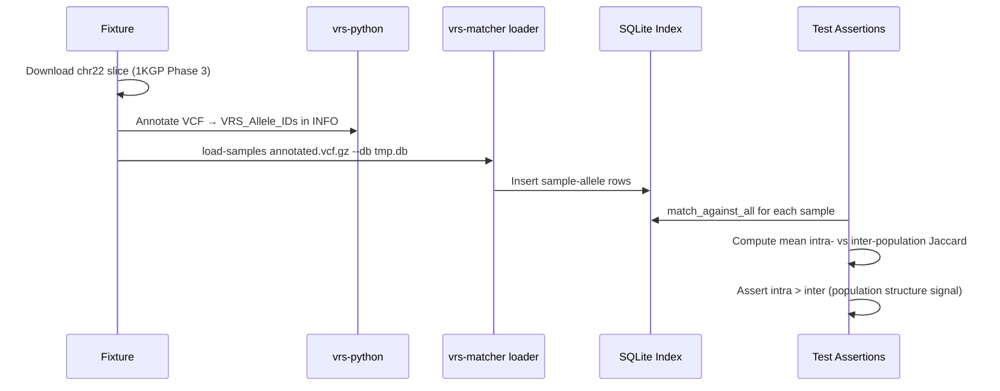

# ADR: 1000 Genomes Integration Test with VRS Annotation

## Status

Accepted

## Use Case

A synthetic unit-test suite validates individual components in isolation using
mocked VCF data, but it cannot detect failures at the seams between components
(VCF parsing → VRS annotation → index ingestion → matching) or confirm that
the similarity metrics produce meaningful signal on real human genotype data.

The integration test addresses three questions that unit tests cannot answer:

1. Does the full pipeline — real VCF download, real VRS annotation, real
   ingestion — complete without error on publicly available data?
2. Do the Jaccard and weighted-concordance scores correctly cluster known
   population-structure groups (super-populations in 1000 Genomes)?
3. Do samples from the same super-population score higher against each other
   than against samples from a different super-population?

## Decision

Implement a pytest integration test (`tests/integration/`) that:

1. Downloads a small, publicly available chromosome slice of 1000 Genomes
   Phase 3 VCF as a transient fixture.
2. Annotates the VCF with `vrs-python` to produce `VRS_Allele_IDs` in INFO.
3. Loads the annotated VCF into a temporary SQLite index with `vrs-matcher
   load-samples`.
4. Asserts that mean intra-super-population Jaccard is strictly greater than
   mean inter-super-population Jaccard, confirming population structure is
   recoverable from the index.

The test is **skipped by default** (marked `pytest.mark.integration`) and
runs only when the caller passes `--run-integration` or sets the environment
variable `RUN_INTEGRATION_TESTS=1`.

## Architecture

### Component Roles

| Component | Responsibility in this test |
|---|---|
| `tests/integration/conftest.py` | `annotated_vcf` fixture — download, annotate, yield path, clean up |
| `tests/integration/test_1kg_cluster.py` | Population structure assertions |
| `vrs-python` (`ga4gh.vrs.extras.vcf_annotation`) | Add `VRS_Allele_IDs` to VCF INFO |
| `vrs-matcher load-samples` | Ingest annotated VCF into SQLite |
| `vrs-matcher` Python API (`match_against_all`) | Retrieve per-sample rankings |

### Runtime Flow



### Input Data

| Property | Value |
|---|---|
| Source | 1000 Genomes Phase 3 (GRCh38 realigned) |
| Region | `chr22:16,000,000-17,000,000` (≈1 Mbp slice) |
| Download URL | `https://ftp.1000genomes.ebi.ac.uk/vol1/ftp/data_collections/1000G_2504_high_coverage/working/20220422_3202_phased_SNV_INDEL_SV/1kGP_high_coverage_Illumina.chr22.filtered.SNV_INDEL_SV_phased_panel.vcf.gz` |
| Tabix index | Same URL + `.tbi` suffix |
| Sample subset | 10 AFR + 10 EUR samples drawn from the Phase 3 panel (hardcoded list for reproducibility) |
| Tool to subset and slice | `pysam.VariantFile(...).fetch(...)` with in-memory sample subsetting |

Restricting to 20 samples and 1 Mbp keeps download and annotation time
manageable in CI while preserving enough variants to observe population signal.

### VRS Annotation

```python
from ga4gh.vrs.dataproxy import create_dataproxy
from ga4gh.vrs.extras.annotator.vcf import VcfAnnotator

data_proxy = create_dataproxy("seqrepo+file:///usr/local/share/seqrepo/2024-12-20")
annotator = VcfAnnotator(data_proxy=data_proxy)
annotator.annotate(input_vcf, output_vcf)
```

`vrs-python` requires a SeqRepo data source. The fixture uses
`GA4GH_VRS_DATAPROXY_URI` (for example,
`seqrepo+file:///usr/local/share/seqrepo/2024-12-20`) and initializes the
proxy with `ga4gh.vrs.dataproxy.create_dataproxy`.

### Assertion Strategy

For each sample `s`, call `match_against_all(conn, s)` and record the
Jaccard score of every peer.  Split peer scores by whether the peer is in the
same super-population or not.

$$
\bar{J}_{\text{intra}} = \frac{1}{|\text{intra pairs}|} \sum_{(a,b)\,\in\,\text{same pop}} J(a,b)
$$

$$
\bar{J}_{\text{inter}} = \frac{1}{|\text{inter pairs}|} \sum_{(a,b)\,\in\,\text{different pop}} J(a,b)
$$

Pass condition:

$$
\bar{J}_{\text{intra}} > \bar{J}_{\text{inter}}
$$

This does not assert a specific numeric threshold, only a directional
signal — making the test robust to VRS version differences and SeqRepo
proxy variation across runs.

### Test Markers and CI Integration

```ini
# pyproject.toml
[tool.pytest.ini_options]
markers = [
    "integration: slow tests requiring network access (deselect with '-m not integration')",
]
```

A separate GitHub Actions workflow (`ci-integration.yml`) runs on a schedule
(weekly) and on manual dispatch. It installs the integration dependency group,
downloads/caches a local seqrepo snapshot, sets `RUN_INTEGRATION_TESTS=1` and
`GA4GH_VRS_DATAPROXY_URI`, then runs only the integration marker:

```yaml
- run: uv sync --group dev --group integration
- run: scripts/setup_integration_data.sh
- run: uv run pytest -m integration --run-integration
```

The standard `ci.yml` workflow is unchanged and never runs integration tests.

## New Dependencies

| Package | Group | Reason |
|---|---|---|
| `ga4gh.vrs[extras]` | `integration` | VCF annotation and SeqRepo proxy |
| `requests` | `integration` | VCF/index download |
| `pysam` | `integration` | Slice/subset VCF records from the remote indexed input |

These go in a dedicated `integration` dependency group in `pyproject.toml` and
are only required when running integration tests.

## Consequences

**Positive**

- Validates the full pipeline against real human genotype data.
- Catches regressions at the vrs-python / cyvcf2 / SQLite boundary.
- Provides a reproducible, public-data benchmark for future algorithm changes.

**Negative / Risks**

- Network dependency: test fails if EBI FTP is unavailable.
- SeqRepo dependency: integration runs require a local seqrepo snapshot and
  sufficient disk space (~10 GB).
- VRS ID stability: changing seqrepo snapshots can change computed VRS IDs
  across runs; the directional assertion mitigates but does not eliminate this
  risk.
- Runtime: expected wall time 3–8 minutes depending on network speed and
  SeqRepo proxy latency.

## Future Extensions

- Extend to additional super-populations (AMR, EAS, SAS) for a fuller
  population structure check.
- Cache the annotated VCF as a GitHub Actions artifact to speed up reruns.
- Add a concordance-based cluster assertion once a larger sample set is tested.
- Replace the REST proxy with a pinned local SeqRepo snapshot for full
  offline reproducibility.
