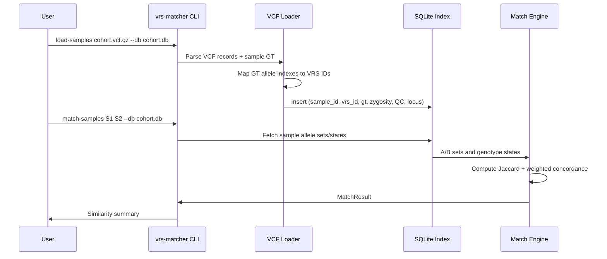

# ADR: Basic Sample Matching with VRS Genotype Index

## Status

Implemented

## Context

The project needs reproducible sample-to-sample matching from VRS-annotated VCF input.
The base VRS identity layer identifies alleles, but matching requires sample-level genotype projection,
filtering, indexing, and comparison metrics.

## Use Cases

1. Load a VRS-annotated cohort VCF into a queryable sample index.
2. Compare two samples and return similarity metrics.
3. Find top matches for one sample against all other indexed samples.
4. List shared VRS alleles between two samples.
5. Apply quality-based filtering (FILTER, GQ, DP) during ingestion.
6. Restrict matching to a candidate set of VRS identifiers.

## Decision

Implement a SQLite-backed sample-allele index with a CLI and two similarity metrics:

1. Jaccard similarity over carried VRS ID sets.
2. Weighted genotype concordance across shared VRS IDs.

## Architecture

### Components

1. `loader.py`
Reads VRS-annotated VCF records with `cyvcf2`, normalizes genotype state, applies filters,
and emits one row per `(sample_id, vrs_id)`.

2. `db.py`
Owns SQLite schema creation and read/write operations.

3. `matcher.py`
Computes Jaccard, weighted concordance, pairwise matching, and match-against-all ranking.

4. `cli.py`
Exposes end-user commands for loading, matching, and shared-variant listing.

5. `models.py`
Defines `Zygosity`, `GenotypeState`, and `SampleGenotype` model types.

### Storage Model

Table `sample_allele`:

- `sample_id` (TEXT)
- `vrs_id` (TEXT)
- `gt` (TEXT)
- `zygosity` (TEXT)
- `chrom` (TEXT)
- `pos` (INTEGER)
- `gq` (REAL)
- `dp` (INTEGER)
- `source_dataset` (TEXT)
- Primary key: `(sample_id, vrs_id)`

Indexes:

- `idx_vrs_id` on `vrs_id`
- `idx_sample_id` on `sample_id`

### Runtime Flow



## Algorithms

### 1. Genotype-to-VRS Mapping

Input: `VRS_Allele_IDs` + sample GT allele indexes.

Rules:

1. Skip REF (`0`) and missing (`None` / negative) allele indexes.
2. Convert ALT allele index `n` to VRS index `n - 1`.
3. Ignore out-of-range indexes.
4. Keep one emitted row per `(sample_id, vrs_id)` within a record.

### 2. Zygosity Inference

Given genotype allele indexes:

1. All missing: `NO_CALL`
2. No non-reference alleles: `REF`
3. All called alleles are same non-reference allele and no missing calls: `HOM_ALT`
4. Otherwise: `HET`

### 3. Filtering Policy (Ingestion)

A sample allele is included only if:

1. Record filter is PASS or unset.
2. Zygosity is not REF.
3. Zygosity is not NO_CALL, unless include-no-call mode is enabled.
4. `GQ >= gq_threshold` when GQ exists.
5. `DP >= dp_threshold` when DP exists.
6. If candidate VRS set provided, `vrs_id` must be in that set.

Default thresholds:

- `GQ`: 20
- `DP`: 0

### 4. Jaccard Similarity

Let $A$ and $B$ be carried VRS sets for two samples.

$$
J(A, B) = \frac{|A \cap B|}{|A \cup B|}
$$

Edge behavior:

- If both sets are empty, return `1.0`.

### 5. Weighted Concordance

For shared VRS IDs only:

1. Matching zygosity on the same VRS ID: `1.0`
2. Different zygosity on the same VRS ID: `0.5`
3. `NO_CALL` in either sample for a shared VRS ID: `0.0`

Final score is mean over all shared VRS IDs. If there are no shared IDs, return `0.0`.

## CLI Surface

1. `vrs-matcher load-samples VCF --db DB [--source-dataset X] [--gq N] [--dp N]`
2. `vrs-matcher match-samples SAMPLE_A SAMPLE_B --db DB`
3. `vrs-matcher match-sample SAMPLE --against all --top N --db DB`
4. `vrs-matcher shared-variants SAMPLE_A SAMPLE_B --db DB`

## Tests

### Current Coverage

1. `tests/test_loader.py`
- zygosity inference (`HET`, `HOM_ALT`, `REF`, `NO_CALL`)
- genotype-to-VRS mapping, including multi-allelic and out-of-range behavior
- load integration via mocked `cyvcf2.VCF`
- GQ threshold filtering

2. `tests/test_db.py`
- insert/upsert behavior
- sample and VRS retrieval
- genotype state reconstruction
- nullable QC field behavior

3. `tests/test_matcher.py`
- Jaccard edge and overlap cases
- weighted concordance scoring rules
- pairwise matching outputs
- candidate set restriction
- match-against-all ordering and top-N behavior

4. `tests/test_cli.py`
- command execution and output checks for all CLI commands
- no-other-sample and no-shared-variant cases

### Validation Command

```bash
uv run ruff check .
uv run ruff format --check .
uv run pytest -q
```

## Consequences

### Positive

1. Deterministic, queryable sample matching based on canonical allele identifiers.
2. Clear separation between ingestion, storage, matching, and CLI concerns.
3. Test-backed behavior for core algorithms and user-facing commands.

### Trade-offs

1. Similarity semantics are project-defined and may evolve.
2. SQLite index size grows with sample and allele counts.
3. Cross-cohort harmonization still affects practical comparability.

## Future Extensions

1. Add explicit rare/candidate/phenotype mode filtering in CLI options.
2. Add same-locus-different-allele penalty support if locus-level comparison data is introduced.
3. Add reproducibility fixtures using small real VRS-annotated VCF examples.
4. Add performance tests for large cohorts.
