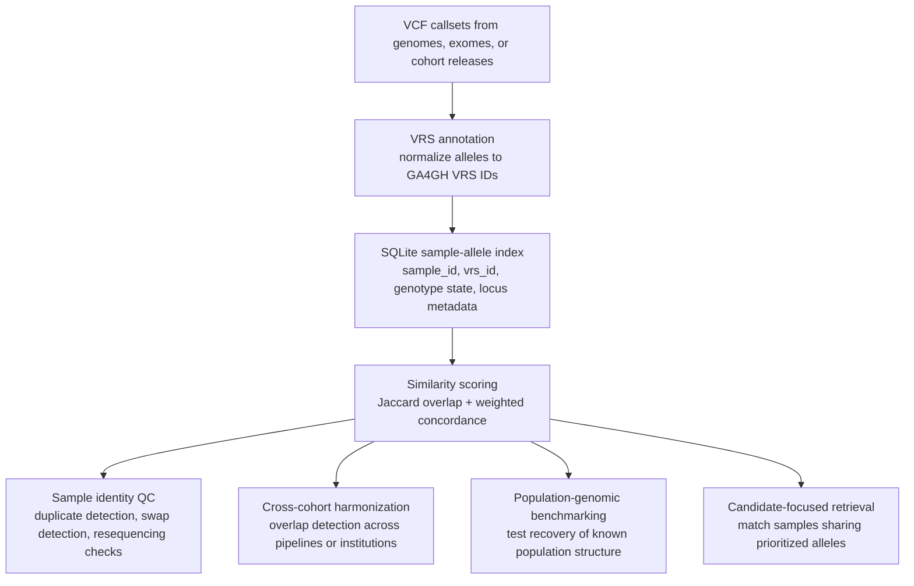
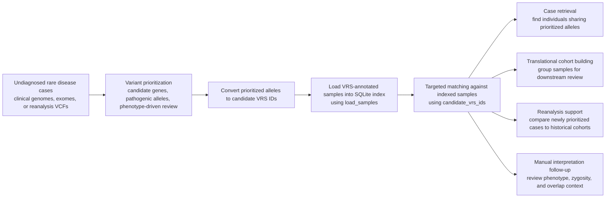

# Applicability of `vrs-matcher` to Genomics Research

## Introduction

Large-scale human genomics studies increasingly require the comparison of
variant data across sequencing assays, bioinformatics pipelines, institutions,
and time points, including in multi-center and longitudinal genomics
workflows. In practice, however, direct comparison of Variant Call Format
(VCF) files is hindered by representational heterogeneity: the same biological
allele may be encoded differently because of left alignment, trimming,
multiallelic decomposition, normalization choices, reference-context
conventions, or caller-specific output behavior. These discrepancies complicate
sample identity verification, cohort harmonization, duplicate detection,
cross-study reconciliation, and downstream reuse of genomic observations. As
population-scale and translational datasets continue to expand, there is a need
for matching methods that operate on biologically stable representations of
variation rather than on raw VCF syntax alone.

`vrs-matcher` addresses this problem by comparing samples on the basis of
**GA4GH Variation Representation Specification (VRS)** identifiers. In this
framework, VCF alleles annotated with VRS are loaded into a lightweight SQLite
index in which each sample is represented as a set of observed VRS Alleles,
along with genotype-state metadata such as zygosity and optional quality/depth
fields. Similarity between samples is then quantified using two complementary
metrics: **Jaccard similarity**, which measures overlap in carried allele sets,
and **weighted concordance**, which measures agreement in genotype state for
shared alleles. By operating on normalized VRS identifiers instead of raw VCF
allele strings, `vrs-matcher` supports more reproducible matching
across datasets that differ in upstream processing but encode the same
underlying biological variation.

This design is well suited to contemporary genomics workflows in which samples
must be aggregated, reconciled, or queried across heterogeneous resources. In
many research settings, the relevant question is not whether two VCF records are
textually identical, but whether two samples carry the same biologically
interpretable alleles at sufficient resolution to support identity checking,
cohort deduplication, or similarity-based retrieval. `vrs-matcher` provides a
practical implementation of this concept by ingesting VRS-annotated VCF data
into a portable database and exposing one-vs-one and one-vs-all sample matching
operations.

**`vrs-matcher` answers recurring sample-level questions in multi-pipeline genomics over time: identity, cohort overlap, candidate-allele retrieval, and longitudinal consistency, on a normalized VRS allele substrate.**

## VRS as the Matching Substrate

The choice of GA4GH VRS as the identifier layer carries several properties that
shape how `vrs-matcher` behaves in practice:

- **Canonical, sequence-based allele identity.** The same allele,
  represented against the same reference, resolves to the same identifier
  regardless of which party performs the annotation, and without prior
  coordination between parties.
- **Reference identity by sequence digest.** VRS locations are anchored to
  refget-backed sequence identifiers rather than to assembly labels such as
  "GRCh38". Once alleles have been placed against equivalent reference
  sequences, their VRS identifiers are comparable in a way that
  assembly-anchored VCF coordinates are not.
- **Normalization consistency across ambiguous regions.** In repeats and other
  regions where the same biological variant may have multiple equivalent
  representations, VRS normalization reduces sensitivity to
  upstream choices such as left-alignment, trimming, or alternative allele
  representations that may otherwise produce different representations of the
  same biological variant.
- **Substrate that extends beyond SNVs and small indels.** The VRS
  specification covers Alleles, Haplotypes, Copy Number, and Genotypes within a
  single identifier scheme. `vrs-matcher` currently indexes Alleles, but the
  underlying representation supports richer variation classes without changes
  to the indexing model.

Together, these properties motivate the use of VRS identifiers as the
comparison layer for cross-pipeline and cross-institution matching. VRS does
not replace upstream alignment steps such as liftover when source data are
aligned to different assemblies. After alleles are placed against equivalent
reference sequences, identity comparison can operate on a normalized,
content-derived representation that is robust to many of the differences
introduced by upstream processing.

## Conceptual Figure

**Figure 1. Conceptual overview of `vrs-matcher` in genomics research.**
VCF-derived alleles are normalized to GA4GH VRS identifiers, loaded into a
portable SQLite index, and compared with set-overlap and genotype-concordance
metrics. The resulting similarity profiles can support sample identity quality
control, cohort harmonization, population-structure benchmarking, and
candidate-variant matching.

## Research Use Cases

### 1. Candidate-variant or panel-restricted matching

The underlying matching functions support restriction to a selected set of VRS
identifiers, enabling targeted comparison over project-defined candidate
variants.

Typical scenarios include:

- retrieving samples that share a prioritized variant panel;
- comparing rare disease cases over a candidate gene or variant list;
- building focused cohorts around pathogenic or likely pathogenic alleles.

**Figure 2. Rare disease and translational genomics workflow enabled by `vrs-matcher`.**
Prioritized alleles from undiagnosed cases can be normalized to VRS IDs and
used for targeted matching against an indexed cohort. This supports retrieval of
partially overlapping cases, construction of translational review cohorts, and
systematic reanalysis when candidate variants are revisited over time.

### 2. Sample identity confirmation

`vrs-matcher` can be used to determine whether two VCFs correspond to the same
biological sample after variant representation has been normalized through VRS.
This is useful for confirming sample identity across pipeline reprocessing,
resequencing, or data exchange between collaborating groups. The addition of
weighted genotype concordance provides a useful second dimension beyond simple
allele overlap, allowing users to distinguish samples that share many alleles but
differ materially in zygosity.

Typical scenarios include:

- confirming that a resequenced genome matches an earlier release;
- identifying potential sample swaps in multi-sample processing batches;
- checking concordance between research and clinical callsets derived from the
  same specimen.

#### Implementation status in current codebase

The current implementation includes the core features needed to support this use
case:

- **VCF ingestion with VRS allele IDs** via `load_samples`, which loads carried
  `VRS_Allele_IDs` values into SQLite.
- **Pairwise identity scoring** via `match_pair` and CLI command
  `match-samples`, reporting Jaccard similarity and weighted concordance.
- **One-vs-all ranking** via `match_against_all` and CLI command `match-sample`,
  enabling duplicate/swap screening against an indexed cohort.
- **Shared-allele inspection** via CLI command `shared-variants` for manual QC
  follow-up.

Operational constraints to account for during identity QC:

- Input VCFs must already be annotated with `VRS_Allele_IDs`.
- Sample IDs are globally keyed in the index (`samples.sample_id` is unique), so
  if two files use the same sample name you should rename one before loading if
  you intend to compare them as separate entries.
- Matching is allele/zygosity based and is not a replacement for kinship/IBD
  inference.

### 3. Cohort deduplication and data release quality control

Large data commons and institutional repositories often accumulate overlapping
samples across releases, consent groups, or partner contributions. A
VRS-based sample index can be used to detect candidate duplicate genomes or
exomes prior to downstream analysis.

Typical scenarios include:

- screening a cohort for repeated submissions of the same individual;
- checking whether incoming partner data overlap with an existing repository;
- validating the uniqueness of samples included in a public release.

#### Implementation status in current codebase

The current implementation includes the core features needed to support this use
case:

- **Cohort ingestion** via `load_samples`, which can load multiple releases into
  the same SQLite index while preserving `source_dataset` provenance.
- **Pairwise QC checks** via `match_pair` and the CLI command `match-samples`
  for confirming candidate duplicates or investigating suspicious overlaps.
- **One-vs-all cohort screening** via `match_against_all` and the CLI command
  `match-sample`, which ranks likely duplicate or near-duplicate samples for a
  query sample.
- **Manual follow-up** via `shared-variants` to inspect the exact normalized
  alleles driving a potential duplicate or release overlap.

Operational constraints to account for during release QC:

- Input VCFs must already be annotated with `VRS_Allele_IDs`.
- Sample IDs are globally keyed in the index (`samples.sample_id` is unique), so
  if the same biological sample appears with the same name in two releases, one
  release should be renamed or prefixed before loading if both entries must
  coexist in the same index.
- Matching is allele/zygosity based and should be interpreted as normalized
  sample similarity, not as kinship or identity-by-descent inference.

### 4. Cross-study harmonization

When cohorts are merged across sequencing centers or analysis pipelines, raw VCF
comparison is often confounded by representation differences. `vrs-matcher`
offers a harmonized matching layer based on normalized allele identity. The
current implementation supports loading a VRS-annotated VCF into SQLite and
comparing a query sample against all indexed samples, making it suitable for
exploratory matching at cohort scale.

Typical scenarios include:

- reconciling legacy callsets with newly reprocessed data;
- identifying overlap between internal cohorts and public reference datasets;
- validating sample continuity in multi-center meta-analysis pipelines.

### 5. Population-genomic benchmarking

Because matching is based on carried allele overlap, `vrs-matcher` can be used
to assess whether biologically meaningful structure is recoverable from indexed
variation data. The current repository includes an integration test based on a
1000 Genomes Project chromosome 22 slice that evaluates whether mean
intra-super-population similarity exceeds mean inter-super-population
similarity.

Typical scenarios include:

- validating ingestion and matching behavior on real human population data;
- benchmarking representation-normalized similarity against known cohort labels;
- testing whether methodological changes preserve expected population signal.

### 6. Longitudinal and reanalysis consistency checking

As samples are reanalyzed over time with updated pipelines or annotations,
researchers need a way to verify that apparent biological differences are not
artifacts of sample misidentification or representational drift.

Typical scenarios include:

- confirming sample continuity across reanalysis cycles;
- comparing frozen historical releases to newly normalized VCFs;
- checking that internal QC results remain stable after annotation updates.

## Applicability to Genomics Research

`vrs-matcher` is most applicable when the research question depends on
**representation-stable comparison of observed alleles**. This includes
situations in which investigators want to know whether two samples are highly
similar, whether a sample already exists in a cohort, or whether a set of
samples shares overlapping allelic content after normalization.

It is particularly useful in the following research areas:

- **Population genomics**, where normalized allele overlap can be used to test
  whether indexed samples recover known structure among populations or study
  groups.
- **Clinical and translational genomics**, where sample identity confirmation
  and cross-pipeline consistency are critical for interpretation and reporting.
- **Rare disease genomics**, where candidate-driven matching may help identify
  cases with overlapping prioritized variants.
- **Federated or multi-institutional genomics**, where a standardized allele
  representation can support comparison across heterogeneous callsets.
- **Genomic data infrastructure and method development**, where a compact and
  queryable variation index is useful for benchmarking, regression testing, and
  pipeline validation.

The tool is especially valuable when:

1. VCF representation differences would otherwise obscure biological
   equivalence;
2. investigators need lightweight sample matching rather than full joint
   genotyping;
3. a transparent, auditable, SQLite-backed implementation is desirable for
   reproducibility and integration into existing pipelines.

## Scope and Limitations

Although `vrs-matcher` is useful for allele-based sample comparison, it is not a
universal replacement for all genomic similarity methods. Its current matching
model is based on **shared carried alleles** and **zygosity concordance**. It is
therefore not designed as a substitute for:

- kinship or identity-by-descent estimation;
- ancestry inference;
- haplotype-aware or phasing-sensitive comparison;
- association testing or burden analysis;
- full probabilistic relatedness modeling.

These boundaries are important for correct interpretation. The tool is best
understood as a representation-normalized sample matching system that complements
rather than replaces specialized statistical genetics methods.

## Practical Summary

In practical genomics research, `vrs-matcher` is best viewed as a tool for
answering questions such as:

- *Which samples share a targeted set of candidate alleles?*
- *Is this newly processed sample the same as one already present in the
  cohort?*
- *Do two VCFs appear to describe the same genome after allele normalization?*
- *Which indexed samples are most similar to a query sample at the level of
  carried VRS alleles?*
- *Can known population structure be recovered from a VRS-based sample index?*

By centering comparison on GA4GH VRS identifiers, `vrs-matcher` provides a
specific and practically useful bridge between normalized variant
representation and sample-level genomics inference.