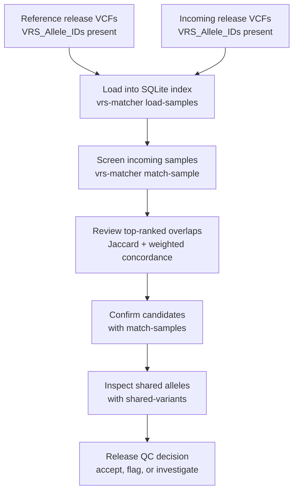

# How To: Cohort Deduplication and Data Release QC with Your Own VCFs

This guide shows a practical workflow for using `vrs-matcher` to screen a new
cohort or data release for overlaps, duplicates, and potential sample swaps.

## When to use this workflow

Use this when you need to:

- check whether an incoming release overlaps with a prior repository;
- find repeated submissions of the same biological sample;
- validate that a release contains unique samples before downstream analysis.

## Prerequisites

- Python 3.12+ and `uv`
- `vrs-matcher` installed (`uv sync` in this repository)
- VCFs annotated with INFO field `VRS_Allele_IDs`

> `vrs-matcher` compares VRS allele identifiers, so unannotated VCFs cannot be
> used for deduplication or release QC.

If the same biological sample appears in multiple releases under the same sample
name, prefix or rename one release before loading so both records can coexist in
one SQLite index.



**Figure 1. Cohort deduplication and data release QC workflow with `vrs-matcher`.**
Load both the reference release and the incoming release into the same SQLite
index, screen incoming samples against the existing cohort, and confirm likely
duplicates with pairwise metrics and shared-allele review.

## 1) Load the reference and incoming releases

Create one SQLite database and load both releases into it.

```bash
uv run vrs-matcher load-samples /path/to/reference_release.vcf.gz --db cohort_qc.db --source-dataset reference_release
uv run vrs-matcher load-samples /path/to/incoming_release.vcf.gz --db cohort_qc.db --source-dataset incoming_release
```

If you are working with multiple files per release, repeat the command for each
VCF. The `--source-dataset` label is useful for provenance tracking in the index.

## 2) Screen each incoming sample against the reference cohort

For a single sample:

```bash
uv run vrs-matcher match-sample INCOMING_SAMPLE_ID --db cohort_qc.db --top 10
```

For a set of incoming samples, repeat `match-sample` for each sample ID in the
new release.

The top-ranked matches are the most likely duplicate or near-duplicate samples.

## 3) Confirm a candidate duplicate with pairwise comparison

Once you have a suspicious pair, run pairwise matching directly:

```bash
uv run vrs-matcher match-samples REFERENCE_SAMPLE_ID INCOMING_SAMPLE_ID --db cohort_qc.db
```

Interpret the output together:

- `Jaccard`: carried allele overlap between the two samples
- `Weighted concordance`: agreement in genotype state across shared alleles
- `Shared variants`: count of shared VRS IDs

## 4) Inspect the exact shared alleles

```bash
uv run vrs-matcher shared-variants REFERENCE_SAMPLE_ID INCOMING_SAMPLE_ID --db cohort_qc.db
```

Use this list to manually confirm whether the overlap is expected and whether
any differences are explainable by pipeline or QC variation.

## Interpreting results for release QC

Use both metrics together:

- high Jaccard + high weighted concordance: strong evidence for a duplicate or
  repeated submission;
- high Jaccard + lower weighted concordance: likely same sample with genotype
  differences, pipeline drift, or quality effects;
- low Jaccard: unlikely to be the same sample.

There is no universal cutoff that fits every release. Calibrate thresholds on
known positives and known negatives from your program.

## Troubleshooting

- `Sample not found in index`: verify that sample IDs match the VCF header
  exactly.
- Unexpectedly low similarity for known duplicates: verify both releases were
  VRS annotated consistently and loaded with comparable filtering.
- Missing matches because of reused sample IDs: rename or prefix one release so
  duplicate biological samples can coexist in the same index.

