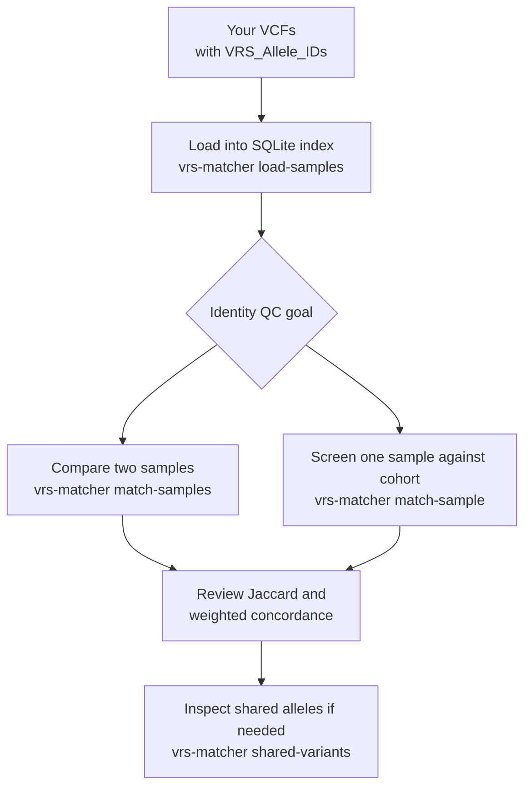

# How To: Sample Identity Confirmation with Your Own VCFs

This guide shows a practical workflow for using `vrs-matcher` to confirm whether
VCF files likely represent the same biological sample.

## When to use this workflow

Use this when you need to:

- compare a reprocessed or resequenced sample against a prior callset;
- screen for potential duplicates or swaps in a cohort;
- inspect shared normalized alleles between two samples.

## Prerequisites

- Python 3.12+ and `uv`
- `vrs-matcher` installed (`uv sync` in this repository)
- VCFs annotated with INFO field `VRS_Allele_IDs`

> `vrs-matcher` compares VRS allele identifiers, so unannotated VCFs cannot be
> matched meaningfully.



**Figure 1. Sample identity confirmation workflow with `vrs-matcher`.**
Load VRS-annotated VCFs into the SQLite index, then either compare two samples
directly or rank one sample against a cohort before inspecting shared alleles
for manual QC follow-up.

## 1) Prepare input VCFs

For reliable comparison:

- ensure each VCF is bgzipped/indexed as needed by your tooling;
- confirm records include `VRS_Allele_IDs`;
- make sure sample names are unique across files you will load into the same DB.

If two files use the same sample ID string but you need them treated as separate
entries (for example, old vs new processing), rename one sample before loading.

## 2) Build the matcher index

Create a SQLite database and load one or more VRS-annotated VCFs.

```bash
uv run vrs-matcher load-samples /path/to/cohort_a.vcf.gz --db sample_index.db --source-dataset cohort_a
uv run vrs-matcher load-samples /path/to/cohort_b.vcf.gz --db sample_index.db --source-dataset cohort_b
```

Optional filters:

- `--gq` minimum genotype quality (default `20`)
- `--dp` minimum depth (default `0`)

## 3) Compare two specific samples

```bash
uv run vrs-matcher match-samples SAMPLE_OLD SAMPLE_NEW --db sample_index.db
```

You will get:

- `Jaccard`: shared carried VRS IDs over union of carried IDs
- `Weighted concordance`: genotype-state agreement over shared VRS IDs
- `Shared variants`: count of shared VRS IDs

## 4) Find the closest matches for one sample

```bash
uv run vrs-matcher match-sample SAMPLE_QUERY --db sample_index.db --top 10
```

This ranks other samples by descending Jaccard similarity.

## 5) Inspect exact shared VRS alleles

```bash
uv run vrs-matcher shared-variants SAMPLE_A SAMPLE_B --db sample_index.db
```

Use this list for manual follow-up in your pipeline/QC notes.

## Interpreting results for identity QC

Use both metrics together:

- high Jaccard + high weighted concordance: strong support for same-sample
  identity;
- high Jaccard + lower weighted concordance: many shared alleles but meaningful
  zygosity differences (pipeline drift, quality effects, or potential issues);
- low Jaccard: unlikely to be the same sample.

There is no universal cutoff that fits all datasets; set project-specific
thresholds using known positives/negatives.

## Troubleshooting

- `Sample not found in index`: verify sample IDs exactly match VCF sample names.
- Very low similarity for expected replicates: verify both inputs were VRS
  annotated consistently and loaded with comparable filtering.
- Unexpectedly merged/overwritten behavior: check for reused sample IDs across
  files and rename before ingestion if separate identities are needed.

