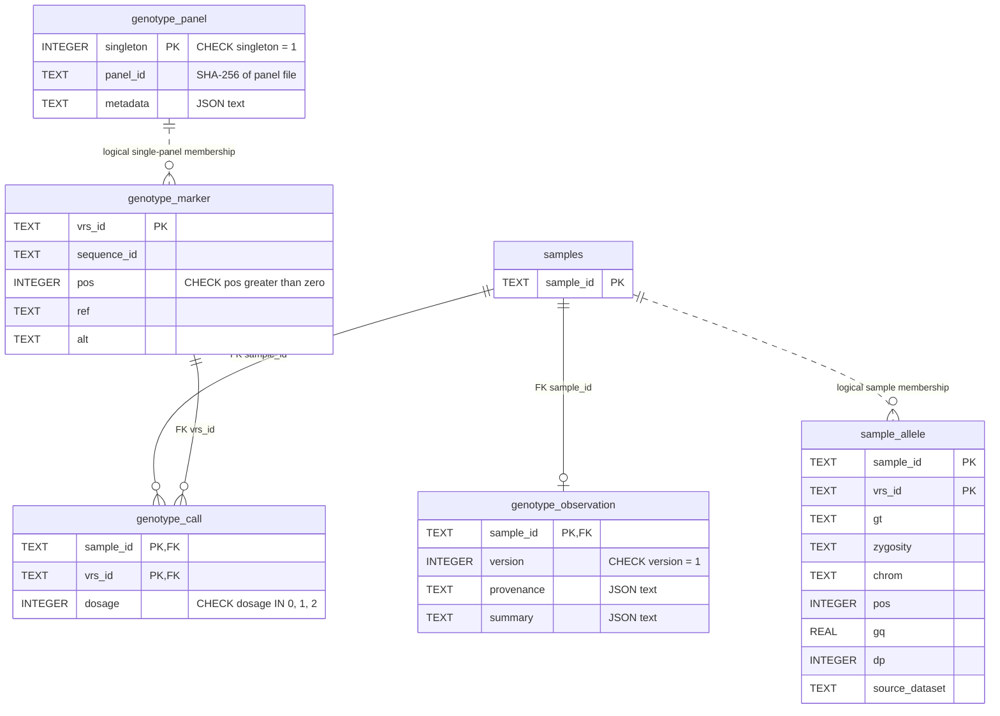
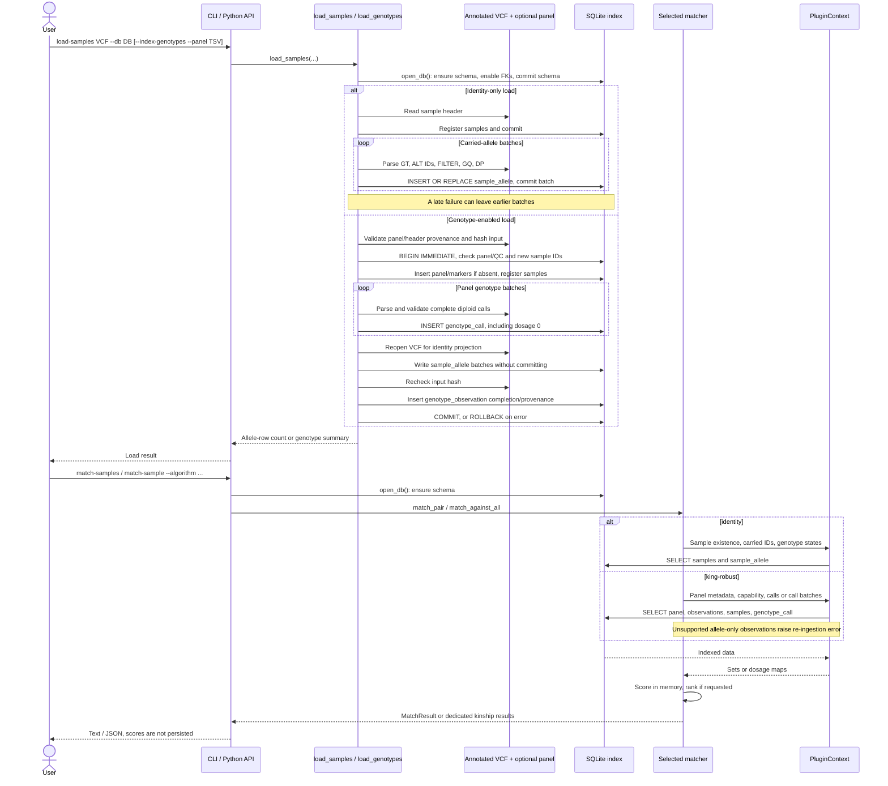

# SQLite index structure and lifecycle

VRS-Matcher stores a reusable sample index in the SQLite file selected by
`--db`. It contains two representations: carried ALT alleles for `identity`
matching, and an optional panel of explicitly called genotypes for
`king-robust`. Scores and rankings are calculated when queried; they are not
stored in the database.

The schema is defined in [db.py](../src/vrs_matcher/db.py). The two ingestion
paths are implemented in [loader.py](../src/vrs_matcher/loader.py) and
[genotypes.py](../src/vrs_matcher/genotypes.py). Matching reads through
[PluginContext](../src/vrs_matcher/plugins.py).

## What each representation means

| Property | Carried-allele index | Called-genotype index |
|---|---|---|
| Primary consumer | `identity` and allele-based plugins | `king-robust` |
| Data table | `sample_allele` | `genotype_call` |
| Row meaning | A sample carries this ALT VRS ID | A sample has a passing, complete diploid call at this panel marker |
| Reference call (`0/0`) | No row | Row with dosage `0` |
| Missing or excluded call | No carried allele row; some partial ALT calls can still produce one | No row; always unknown/excluded, never inferred reference |
| Marker universe | Carried IDs surviving the identity loader's filters | Complete declared panel in `genotype_marker`, including markers with no calls |
| Genotype representation | Original GT string and record-level zygosity | ALT dosage `0`, `1`, or `2`; phase is not retained here |
| Population | Default loading, and also during genotype-enabled loading | Only `--index-genotypes --panel PANEL.tsv` |

Both use `samples` as the observation registry. A sample can exist with zero
surviving allele rows or zero passing genotype calls. Names identify indexed
observations, not necessarily biological donors: use separate names for
replicates or reprocessed versions. `source_dataset` is provenance, not a key
namespace.

## Database ERD

`PK` and `FK` mark actual key columns. Two `PK` columns within a table form one
composite primary key. Edges labeled **logical** describe loader-maintained
associations, not SQL foreign keys; the dotted line is a visual aid for those
associations in this diagram.



### Tables and constraints

| Table | Content and invariants |
|---|---|
| `samples` | One registry row per sample name. Registration uses `INSERT OR IGNORE`. There is no donor, pedigree, or ancestry table. |
| `sample_allele` | Key `(sample_id, vrs_id)`. Stores GT, zygosity, input chromosome and one-based position, optional GQ/DP, and source label. There is **no declared FK** to `samples` or `genotype_marker`; insertion helpers register names. Its VRS IDs need not belong to the KING panel. |
| `genotype_panel` | At most one row, with `singleton=1`. `panel_id` is the SHA-256 of the exact panel TSV bytes. `metadata` records that ID, reference, annotation version, and QC policy. An allele-only database has no panel row. |
| `genotype_marker` | Complete panel, keyed by ALT VRS ID. `UNIQUE(sequence_id, pos)` allows one marker per locus; positions must be positive and use VCF one-based coordinates. Reference identity uses a `ga4gh:SQ` digest. The loader validates distinct A/C/G/T REF and ALT bases. There is no `panel_id` FK because this implementation permits one panel per database. |
| `genotype_observation` | One completed genotype-ingestion record per sample, with an FK to `samples`. `version=1` is the genotype capability version, not a global schema migration version. A completed observation may have no calls. |
| `genotype_call` | Key `(sample_id, vrs_id)`, FKs to `samples` and `genotype_marker`, and dosage constrained to 0/1/2. These three columns are NOT NULL. There is no FK to `genotype_observation`; atomic ingestion and reader capability checks establish completion. |

SQLite creates indexes for the primary and unique keys. Two additional indexes
exist on `sample_allele`: `idx_sample_id(sample_id)` and `idx_vrs_id(vrs_id)`.
The composite call primary key supports reads by sample and sample batches.
There is no explicit genotype-call index with `vrs_id` as its leading column.

Foreign-key enforcement is enabled by `open_db()` on each connection it opens.
No cascading delete behavior or database trigger makes observations immutable;
replacement protection is implemented by the ingestion helpers.

### Metadata and provenance

The three JSON documents are stored as SQLite TEXT, not separate relational
tables:

- `genotype_panel.metadata`: `panel_id`, `reference`, `annotation_version`, and
  `qc` containing GQ/DP thresholds, missing-QC policy, and record FILTER policy.
- `genotype_observation.provenance`: `input_sha256` and `source_dataset` for
  the input containing that observation.
- `genotype_observation.summary`: `records` contains the load's shared record
  counters; `calls` contains that sample's dosage, exclusion, and missing-QC
  counters. Record counters are repeated across observations from one load;
  do not sum them across samples. Missing-QC counters overlap call outcomes.

Only counters that occur need appear in these documents. GQ/DP and phase are
not stored per reference call in `genotype_call`; preserve source VCFs for
reprocessing. The loader also returns an aggregate summary for genotype loads.

## When the database is created

`open_db(path)` opens or creates SQLite, enables foreign keys, executes
`CREATE TABLE/INDEX IF NOT EXISTS` for **all six tables**, and commits schema
initialization. Consequently, even an identity-only database has empty genotype
tables after being opened by current code. Table existence alone does not make
it KING-ready.

Matching CLI commands require an existing file, but also call `open_db()`;
opening an older file can add missing schema objects. This connection is not
opened in SQLite read-only mode. Matching itself reads persisted observations
and computes results without storing scores. There is no automatic backfill of
reference calls, general schema migration engine, or background index refresh.

## When and how data is populated

### Default carried-allele loading

```bash
uv run vrs-matcher load-samples cohort.vrs.vcf.gz --db identity.db
```

`load_samples()` registers all names from the VCF header and commits them first.
It then streams records through `_iter_rows()` with cyvcf2:

1. Retain PASS/unfiltered records with usable `VRS_Allele_IDs`.
2. Map positive GT allele indexes to their corresponding ALT VRS IDs; ignore
   reference, missing, and out-of-range indexes. Emit each carried ID once per
   record/sample. Reference-only and fully missing genotypes emit no allele
   rows, even with the Python `include_no_call` option.
3. Apply GQ/DP thresholds when values exist (defaults 20 and 0); missing QC is
   allowed. A partial call such as `./1` can emit its called ALT as `HET`.
   The Python API can restrict emitted IDs with `candidate_vrs_ids`.
4. Write batches of 10,000 rows through `insert_alleles()`, which registers
   names and uses `INSERT OR REPLACE` on `(sample_id, vrs_id)`. Commit each batch,
   then the final partial batch.

This path is **not atomic across the complete file**: a late failure can leave
registered samples and earlier batches. Reusing a sample name can replace
matching allele keys and retain old keys absent from the new input; it is not
a whole-observation replacement. The reported load count is emitted rows, not
necessarily the final number of unique database rows. `insert_alleles()` rejects
writes for samples already marked complete in `genotype_observation`.

### Genotype-enabled loading

```bash
uv run vrs-matcher load-samples cohort.vrs.vcf.gz --db king.db \
  --index-genotypes --panel king-panel.tsv --source-dataset release-1
```

`load_samples()` delegates to `load_genotypes()`. The panel and VCF must declare
matching reference and annotation provenance, and used panel-contig aliases
must agree on sequence digest. See the [KING guide](how-to-king-robust.md) for
the exact TSV columns and VCF headers. VRS generation and sequence normalization
remain upstream operations.

After panel/header validation and an input hash, ingestion takes a SQLite writer
reservation with `BEGIN IMMEDIATE`. Within one transaction it:

1. Checks any existing panel metadata and QC policy for equality, and rejects
   observation IDs already present in `samples`, including allele-only names.
2. On the first load, inserts the singleton panel metadata and the **entire**
   marker list. Registers incoming samples without committing separately.
3. Parses panel records, validates identities/orientation, and writes passing
   complete diploid calls, including dosage 0. Inserts in 10,000-call batches
   without committing those batches. Missing/partial calls, failed QC, and
   unsupported records produce no genotype row and are counted. Panel sites
   absent from the VCF remain uncalled; no reference calls are imputed.
4. Reopens the VCF for a second parsing pass through the existing `_iter_rows()`
   identity projection and writes carried-allele batches with `commit=False`.
   This projection keeps its existing scope; it is not restricted to the KING
   panel, and its partial-call behavior is unchanged.
5. Rechecks the VCF hash, inserts completed `genotype_observation` records with
   provenance and summaries, and commits all data together.

An error rolls back the transaction, including newly added panel data, samples,
calls, and carried alleles; previously committed observations remain intact.
Schema objects created before the transaction may remain. Successful appends
must use new observation names and the same panel file/provenance/QC policy.
To replace observations or change that policy, rebuild from source inputs.

## Sequence diagram: loading and querying



For brevity, the diagram groups reads; implementations may issue several SELECTs
per pair or batch. Genotype loading reads the panel before opening the database;
its schema initialization still precedes the data transaction shown above.

## When and how the index is read

| Entry point | Tables and helpers | Work after retrieval |
|---|---|---|
| `identity.match_pair` | `sample_exists()` reads `samples`; `get_vrs_ids()` and `get_genotype_states()` read `sample_allele` for both samples | Optional candidate restriction, Jaccard on carried IDs, and zygosity concordance over shared IDs |
| `identity.match_against_all` | `list_samples()` returns sorted registry names; the matcher runs the pair path for each other sample | Sort all results by descending Jaccard, then truncate to top-N |
| `shared-variants` CLI | Runs the selected pair matcher; allele results contain shared VRS IDs | Print sorted IDs; dedicated KING results are rejected |
| `king-robust.match_pair` | `get_genotype_panel()` reads metadata; `get_called_genotypes()` checks `samples` and completed capability version, then reads `genotype_call` | Intersect called marker IDs, apply optional candidate restriction, calculate counts and both kinship estimates |
| `king-robust.match_against_all` | Load query calls once; read peer calls in batches of 128 through `get_called_genotypes_many()` | Score peers, retain top-N scorable results in a heap, sort by kinship descending/sample ID ascending, and return all unscorable peers separately |
| `king-robust.iter_all_pairs` | Read call maps in sample tiles, default 128; keep at most two tiles at once | Yield each unordered distinct pair once; the benchmark streams these scores to TSV |

`get_called_genotypes_many()` validates names and completion versions using a
join of `samples` with `genotype_observation`, then fetches calls with
`WHERE sample_id IN (...)`. Its standalone default SQL batch size is 500;
KING's normal cohort traversal uses 128-sample batches. Empty call maps are
valid for completed all-missing observations. An unregistered sample is an
error, and a registered sample without completed genotype ingestion requires
re-ingestion. A mixed index can therefore serve identity queries but fail a KING
cohort query when an allele-only peer is encountered.

When candidate IDs are supplied to KING, `get_panel_ids()` reads
`genotype_marker` to reject IDs outside the panel. Restrictions are applied to
retrieved maps in memory; they do not rewrite persisted rows. Both algorithms
use registered names to discover samples, so empty observations remain visible.

The genotype index stores no kinship matrix or retrieval cache. Tiles can be
reread across all-pairs iteration; transient memory depends on calls per sample
and tile size. A bounded top-N heap does not bound the list of unscorable peers.
See the [performance ADR](adr-king-performance.md) for these tradeoffs.

## Inspect an index

These read-only SQL queries show contents without treating an empty sample as
an unregistered one:

```sql
-- Counts of carried alleles and explicit calls for every registered observation.
SELECT s.sample_id,
       (SELECT COUNT(*) FROM sample_allele a WHERE a.sample_id = s.sample_id) AS carried_ids,
       (SELECT COUNT(*) FROM genotype_call g WHERE g.sample_id = s.sample_id) AS called_markers,
       o.version AS genotype_capability
FROM samples s
LEFT JOIN genotype_observation o USING (sample_id)
ORDER BY s.sample_id;

-- Declared panel policy and provenance, stored as JSON text.
SELECT panel_id, metadata FROM genotype_panel;
SELECT sample_id, provenance, summary FROM genotype_observation;

-- Reference calls are explicit rows in the genotype representation.
SELECT sample_id, COUNT(*) AS reference_calls
FROM genotype_call
WHERE dosage = 0
GROUP BY sample_id;
```

A NULL capability in the first query means no completed genotype ingestion;
zero `called_markers` with capability 1 means a completed but empty observation.
See the [KING user story](user-story-king-robust-plugin.md) for acceptance cases
and the [plugin guide](plugins.md) for extending read/scoring behavior.
