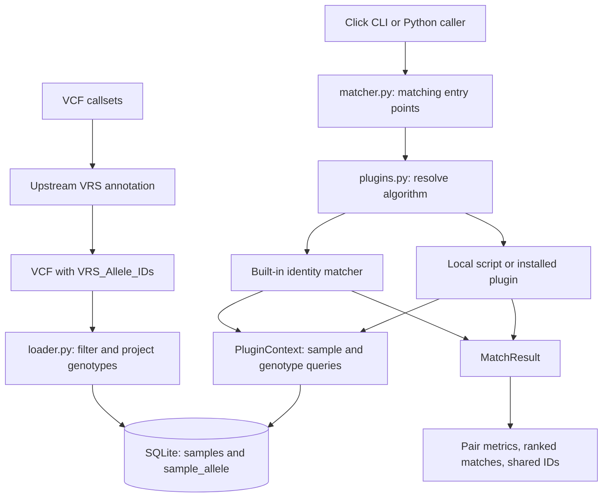

# vrs-matcher walkthrough

A presentation and hands-on guide to use cases, architecture, implementation,
and sample matching with VRS allele identifiers.

Audience: researchers comparing callsets and developers extending the matcher.
Allow about 15 minutes for the presentation and 10 minutes for the local tutorial.
The examples describe the implementation in this checkout.

## 1. Use cases: what questions can we answer?

`vrs-matcher` represents each sample as a set of carried alternate allele IDs
with genotype metadata. It compares those sets and reports both allele overlap
and agreement in zygosity.

| Use case | Question | Workflow |
| --- | --- | --- |
| Sample identity QC | Does a resequenced or reprocessed sample resemble its earlier callset? | Load both under distinct sample IDs, compare the pair, inspect shared alleles. |
| Duplicate and swap screening | Which indexed samples most resemble an incoming sample? | Rank the query against every other indexed sample, then investigate candidate pairs. |
| Release reconciliation | Do incoming submissions overlap an existing cohort? | Load releases into one database with distinct sample IDs and dataset labels. |
| Candidate-allele retrieval | Which samples overlap a selected variant panel? | Pass a VRS ID allowlist through the Python matching API. |
| Method development | Would a different score or ranking help this study? | Run a local plugin on the same indexed data and compare it with `identity`. |
| Population benchmarking | Does the pipeline retain an expected population similarity signal? | Run the optional 1000 Genomes integration test. |

These workflows produce similarity evidence for review. The implementation
does not supply a universal identity cutoff, kinship estimates, ancestry
assignments, or phenotype interpretation.

### Why use VRS IDs?

The matching key is the annotated allele identifier, rather than the literal
VCF chromosome/position/REF/ALT tuple. This puts responsibility for consistent
allele representation in the upstream VRS annotation process.

The loader consumes existing IDs: it does not generate, validate, normalize,
or translate them between references. Comparable annotation and reference
context are prerequisites for meaningful comparisons.

## 2. Architecture: from VCF to ranked samples



The application is a local Python package with a CLI and a SQLite file. Loading
and matching are separate operations, so the database can be reused for many
comparisons. Plugins replace scoring and ranking after ingestion.

| Component | Responsibility |
| --- | --- |
| [cli.py](../src/vrs_matcher/cli.py) | Click commands, options, result formatting, sample/plugin error messages. |
| [loader.py](../src/vrs_matcher/loader.py) | Parse with `cyvcf2`, apply filters, map GT allele indexes to VRS IDs, batch writes. |
| [db.py](../src/vrs_matcher/db.py) | Create schema, register samples, insert alleles, query IDs and genotype states. |
| [models.py](../src/vrs_matcher/models.py) | `Zygosity`, `GenotypeState`, and `SampleGenotype` data models. |
| [matcher.py](../src/vrs_matcher/matcher.py) | Public matching functions, `MatchResult`, and the built-in identity plugin. |
| [plugins.py](../src/vrs_matcher/plugins.py) | Plugin contract, context helpers, discovery, validation, and resolution. |

Runtime dependencies are Click and `cyvcf2`, plus Python's standard-library
SQLite support. Python 3.12 or later is required. VRS annotation dependencies
are in the optional integration dependency group.

## 3. Implementation: what is indexed?

### Ingestion rules

1. Register every sample in the VCF header, including samples that retain no alleles.
2. Keep records with `PASS` or an unset filter; skip other filtered records.
3. Read `VRS_Allele_IDs`, a VCF INFO field containing a comma-separated list
   of GA4GH Variation Representation Specification (VRS) allele identifiers
   for the record's alternate alleles. **The input VCF must already have been
   processed by an upstream VRS annotator**, with this field declared in the
   header and populated on the records to be indexed. `load-samples` does not
   compute or append VRS IDs. Records where the field is absent or empty are
   silently skipped. If all records lack the annotation, loading reports
   `Loaded 0 allele records ...`; header sample IDs are still registered, but
   no allele evidence is added. Annotate the VCF before loading it for matching.
4. Interpret the ID list in ALT order: genotype index `1` selects the first ID,
   `2` the second, and so on. The list must contain ALT IDs in that order,
   without a leading reference-allele ID.
5. Skip reference-only and fully missing genotypes. A partially missing call
   such as `./1` can still contribute its known alternate allele as `HET`.
6. Apply per-sample GQ and DP thresholds when those values exist. **GQ
   (genotype quality)** is the Phred-scaled confidence in the genotype call;
   GQ 20 corresponds to an estimated 1% probability that the call is incorrect.
   **DP (read depth)** is the number of reads covering the site for that sample.
   Defaults are GQ ≥ 20 and DP ≥ 0 (no minimum coverage requirement). Set
   `--gq` and `--dp` to change these minimums; values below either threshold
   are excluded, while missing values do not cause rejection.
7. Emit one row per distinct carried VRS ID for a sample at that record,
   optionally restricted by the Python API's `candidate_vrs_ids` allowlist.
8. Insert in batches of 10,000 rows.

Phased GT strings are preserved, but identity scoring uses zygosity rather than
phase. At a multiallelic `1/2` call, both carried IDs get the record's `HET`
state. A fully missing call emits no allele rows even when the Python
`include_no_call` argument is enabled.

### Storage and reload behavior

| Table | Key | Stored information |
| --- | --- | --- |
| `samples` | `sample_id` | All registered sample IDs. |
| `sample_allele` | `(sample_id, vrs_id)` | GT, zygosity, chromosome, position, GQ, DP, and source dataset. |

The allele table has indexes on `vrs_id` and `sample_id`. Coordinates are
retained as metadata; the built-in matcher compares IDs.

Writes use `INSERT OR REPLACE`. Reloading an existing sample/allele replaces
that row, including its dataset label. Alleles absent from a later load remain
in the database. Therefore a reload does not replace an entire callset, and
`--source-dataset` does not create a separate sample namespace. Use distinct
sample IDs to compare releases and a fresh database when changing filters for
a reproducible rebuild. The loader's reported count is rows processed for
insertion, not necessarily newly added unique rows.

Batch commits mean an interrupted load can leave a partially populated index.

## 4. Implementation: how matching works

For carried allele sets `A` and `B`, the built-in `identity` plugin computes:

```text
Jaccard = number of shared IDs / number of IDs in either sample
        = |A ∩ B| / |A ∪ B|

Weighted concordance = mean genotype score across shared IDs
```

| Genotype relationship at a shared ID | Score |
| --- | --- |
| Same zygosity | 1.0 |
| Different zygosity | 0.5 |
| Either state is `NO_CALL` | 0.0 |

Despite its name, weighted concordance does not weight by GQ, DP, or allele
frequency. Those quality fields affect ingestion, while concordance averages
the zygosity scores equally over shared IDs. Nonshared alleles affect Jaccard
but are outside the concordance denominator.

`MatchResult` contains sample IDs, both metrics, the shared ID set, and each
sample's allele count. Pairwise matching checks sample registration first.
One-vs-all matching excludes the query itself, evaluates every other sample,
sorts by descending Jaccard, and then applies `top_n`. The CLI defaults to 20
results; `--top` limits output rather than comparison work.

### Edge cases and interpretation

- Two empty allele sets score Jaccard `1.0` and concordance `0.0`. This means
  there is no indexed evidence, and must not be treated as an identity match.
- No shared alleles yields concordance `0.0`.
- A registered sample with zero alleles is different from an unknown sample;
  the latter produces a sample-not-found error.
- Missing indexed alleles can reflect reference calls, missing calls, filtering,
  or different assay coverage. The index does not retain a full callable-locus
  matrix to distinguish these explanations.
- Concordance `1.0` over a small shared set can coexist with low overall overlap.
  Review shared counts and total allele counts alongside both metrics.

The current one-vs-all implementation reloads sample data for each pair and
sorts all results. Repeating this for an entire cohort entails a quadratic
number of pair comparisons. Measure performance on your cohort before scaling.

## 5. Implementation: extending the matcher

`identity` is the shipped built-in algorithm. `MatchMode` also names `rare`,
`candidate`, and `phenotype`, but those enum values do not register algorithms.
They describe intended comparison scopes:

| Mode | Meaning | Current support |
| --- | --- | --- |
| `rare` | Restrict comparison to rare or high-impact variants, selected using allele-frequency or functional-impact annotations. | No built-in frequency cutoff, impact annotation, or rare-variant selector. Supply externally selected VRS IDs through the Python allowlist, or implement a plugin for custom scoring. |
| `candidate` | Restrict comparison to an explicit, user-provided set of candidate variants, such as a study's prioritized allele panel. | The Python `candidate_vrs_ids` argument restricts the built-in identity comparison to that set; there is no CLI candidate allowlist option. |
| `phenotype` | Restrict comparison to variants in genes or regions selected using phenotype information, such as observed traits or symptoms. | Phenotype-to-gene/region prioritization and conversion to VRS IDs must happen upstream or in custom code; no built-in phenotype matcher performs these steps. |

Passing `--algorithm rare`, `--algorithm candidate`, or `--algorithm phenotype`
does not activate these scopes by itself: it requires an installed plugin with
that name. Without one, the CLI reports a plugin-not-found error. An externally
prepared allowlist can instead be used with `identity` through the Python API,
as shown in tutorial step 5.

Plugins can come from a local Python file with `create_plugin()` or an installed
package using the `vrs_matcher.plugins` entry-point group. Each plugin supplies:

- A nonempty `name` and `api_version = "1"`.
- `match_pair(context, sample_a, sample_b, *, candidate_vrs_ids=None)`.
- `match_against_all(context, sample_id, *, top_n=None, candidate_vrs_ids=None)`.

The context provides `sample_exists`, `list_samples`, `get_vrs_ids`, and
`get_genotype_states`. Plugins return the existing `MatchResult` structure.
The CLI still labels the primary score `Jaccard` if a plugin changes its
meaning, so custom semantics need documentation.

Local plugin files execute Python code and should be trusted. The context's
query helpers are intended for reading, but its exposed connection is not an
enforced read-only boundary.

See the [plugin guide](../docs/plugins.md) for a complete template and packaging
instructions. The adjacent [feature proposal](feature-plugin-description.md)
and [location-aware proposal](location-aware-plugin.md) describe extension ideas;
their presence does not make them built-in features.

## 6. Tutorial: run a complete local example

Run commands from the repository root in Bash with Python 3.12+ and `uv`
available. The bundled input already contains illustrative VRS-style IDs;
no reference download or annotation service is needed for this tutorial.
These shortened IDs are teaching fixtures, not computed identifiers for reuse
in real datasets.

### Step 1: prepare the environment and a fresh workspace

```bash
uv sync
uv run vrs-matcher --help
WALKTHROUGH_DIR=$(mktemp -d)
export WALKTHROUGH_DB="$WALKTHROUGH_DIR/matches.db"
```

`WALKTHROUGH_DIR` is a user-defined shell variable used only to coordinate this
tutorial; the package does not read it. `mktemp -d` creates a fresh temporary
directory and assigns its path to the variable. It is not exported as an
environment variable.

`WALKTHROUGH_DB` is also tutorial-defined, but is exported so the Python example
can read it through `os.environ`. It holds the database path inside that
directory. The CLI receives this path explicitly through `--db`; the package
does not automatically use either variable as configuration.

Keep using this shell so both variables remain available. The temporary
directory gives each tutorial run a fresh database.

### Step 2: load the example cohort

```bash
uv run vrs-matcher load-samples examples/example-cohort.vcf \
  --db "$WALKTHROUGH_DB" --source-dataset tutorial --gq 20 --dp 0
```

`--gq 20` excludes sample genotype calls with a reported genotype quality below
20 (a Phred score corresponding to an estimated 1% error probability).
`--dp 0` sets the minimum reported read depth to zero, so no positive minimum
coverage is required. Calls exactly at either threshold pass that filter;
missing GQ or DP values do not cause rejection. These are the package defaults,
shown explicitly to make the tutorial's filtering reproducible. Other ingestion
rules, such as record filters and carried-allele selection, still apply.

Expect `Loaded 6 allele records into ...`. The fixture contains three samples:

| Sample | Carried ID suffixes | Count |
| --- | --- | --- |
| `SAMPLE_A` | `abc123`, `def456`, `ghi789` | 3 |
| `SAMPLE_B` | `abc123`, `ghi789` | 2 |
| `SAMPLE_C` | `def456` | 1 |

All IDs have the prefix `ga4gh:VA.`. The fixture may produce a parser warning
because `chr1` lacks a contig header declaration; loading still succeeds.

### Step 3: compare two samples

```bash
uv run vrs-matcher match-samples SAMPLE_A SAMPLE_B --db "$WALKTHROUGH_DB"
```

Expected output:

```text
Jaccard:              0.6667
Weighted concordance: 1.0000
Shared variants:      2
Total alleles (A/B):  3 / 2
```

Two IDs are shared out of three in the union, and both shared genotypes agree
in zygosity. For `SAMPLE_A` versus `SAMPLE_C`, Jaccard is `0.3333` and
concordance is `0.5000`: their one shared allele is homozygous alternate in A
and heterozygous in C.

### Step 4: rank the cohort and inspect shared alleles

```bash
uv run vrs-matcher match-sample SAMPLE_A \
  --db "$WALKTHROUGH_DB" --against all --top 2
uv run vrs-matcher shared-variants SAMPLE_A SAMPLE_B --db "$WALKTHROUGH_DB"
```

`--against all` compares `SAMPLE_A` with every other registered sample in the
database, excluding `SAMPLE_A` itself. `all` is the default and currently the
only supported comparison scope; it includes samples from every source dataset.
`--top 2` displays at most the two highest-ranked matches, ordered by descending
Jaccard for the built-in identity algorithm. It limits the output, not the
comparison work: all other samples are scored before the top two are selected.
Without `--top`, the CLI displays up to 20 matches. These options belong to
`match-sample`; the following `shared-variants` command compares only the named
pair.

The ranking places B first (`0.6667`, concordance `1.0000`, 2 shared), then C
(`0.3333`, concordance `0.5000`, 1 shared). The shared-variant command prints:

```text
ga4gh:VA.abc123
ga4gh:VA.ghi789
```

### Step 5: restrict matching through Python

The previous steps compare all indexed alleles. This optional step asks a more
focused question: **do these samples agree on a selected set of candidate
alleles?** This is useful when a study prioritizes a variant panel and wants
differences outside that panel to have no effect on the comparison.

We use a short Python script because the matching API accepts a
`candidate_vrs_ids` allowlist, but the CLI does not expose an equivalent option.
No script is needed for the full-sample comparisons in steps 3 and 4, and this
step does not require a custom plugin.

> **Suggested improvement:** Expose the existing allowlist support through a
> `--candidate-vrs-file PATH` option on `match-samples`, `match-sample`, and
> `shared-variants`. The file would contain one VRS ID per line, passed to the
> existing `candidate_vrs_ids` argument. Reject an empty allowlist to avoid
> misleading empty-set scores. This would let users perform this step with a
> file and a CLI command instead of a Python script, while keeping
> `--algorithm identity` for scoring. This option is proposed, not currently
> implemented.

Here we select `abc123` and `ghi789`, the two alleles shared by `SAMPLE_A` and
`SAMPLE_B`. Excluding A's additional `def456` allele changes the comparison
scope: we expect Jaccard to rise from `0.6667` to `1.0`, with concordance
remaining `1.0`. This illustrates how panel selection changes the question
being answered; in a real study, select the panel from the research criteria
rather than choosing shared alleles to improve the score.

The script opens the existing tutorial database, calls the built-in matcher
with the allowlist, prints and checks the expected results, and closes the
connection. It does not modify the stored allele data:

```bash
uv run python - <<'PY'
import os
from vrs_matcher.db import open_db
from vrs_matcher.matcher import match_pair

conn = open_db(os.environ["WALKTHROUGH_DB"])
try:
    result = match_pair(
        conn,
        "SAMPLE_A",
        "SAMPLE_B",
        candidate_vrs_ids=frozenset({"ga4gh:VA.abc123", "ga4gh:VA.ghi789"}),
    )
    print(result.jaccard, result.weighted_concordance, result.total_a, result.total_b)
    assert (result.jaccard, result.weighted_concordance) == (1.0, 1.0)
    assert (result.total_a, result.total_b) == (2, 2)
finally:
    conn.close()
PY
```

Expected output is `1.0 1.0 2 2`. Both samples carry all selected IDs. The score
now describes agreement on this panel rather than on the full indexed sets.

### Step 6: compare a teaching plugin with the default

```bash
uv run vrs-matcher plugins list
uv run vrs-matcher match-samples SAMPLE_B SAMPLE_C --db "$WALKTHROUGH_DB"
uv run vrs-matcher match-samples SAMPLE_B SAMPLE_C \
  --db "$WALKTHROUGH_DB" \
  --plugin-file examples/plugins/jaccard_floor_plugin.py
```

The plugin list includes `identity`; local scripts are selected by file and
do not appear automatically in that list. B and C have no shared IDs. The
default reports Jaccard `0.0000`; the example plugin reports `0.2000` because
its factory sets a score floor of 0.2. Both report zero shared variants and
concordance `0.0000`. This demonstrates plugin dispatch and changed score
semantics, not a validated identity-scoring method.

## 7. Tutorial: apply the workflow to your own data

Prepare VCFs with correctly ordered ALT-only `VRS_Allele_IDs`. Give callsets
distinct sample names if you want them to remain separately comparable.
Replace the placeholder paths and sample IDs below:

```bash
uv run vrs-matcher load-samples /path/to/reference.vcf.gz \
  --db release_qc.db --source-dataset reference --gq 20 --dp 10
uv run vrs-matcher load-samples /path/to/incoming.vcf.gz \
  --db release_qc.db --source-dataset incoming --gq 20 --dp 10
uv run vrs-matcher match-sample INCOMING_SAMPLE --db release_qc.db --top 10
uv run vrs-matcher match-samples REFERENCE_SAMPLE INCOMING_SAMPLE --db release_qc.db
uv run vrs-matcher shared-variants REFERENCE_SAMPLE INCOMING_SAMPLE --db release_qc.db
```

One-vs-all searches every other sample in the database, including other incoming
samples; `source_dataset` does not restrict the search. Establish interpretation
thresholds using known matching and nonmatching pairs processed with comparable
annotation, coverage, and filtering.

| Symptom | Check |
| --- | --- |
| Zero allele records loaded | INFO annotation, ALT ordering, record filters, GT, and GQ/DP thresholds. |
| Sample not found | Exact sample name in the VCF header and the selected database path. |
| Unexpectedly high empty-sample scores | Total allele and shared counts; both empty sets have Jaccard 1.0. |
| Known matching callsets score poorly | Comparable callable regions, upstream annotation/reference context, and filters. |
| Two releases appear as one sample | Sample IDs were reused; dataset labels do not namespace them. |
| Changed filters seem ineffective | Rebuild in a fresh database; reloads do not remove old allele rows. |
| Plugin not found | `plugins list`, installed package environment, or the local plugin path/name. |

## 8. Validation and further reading

The repository has unit tests for models, storage, ingestion, matching, plugins,
CLI behavior, and notebook examples. Run the default suite with:

```bash
uv run pytest
```

The optional integration test fetches a chromosome 22 slice for 20 selected
1000 Genomes samples, annotates it with VRS IDs, loads it, and checks that mean
within-super-population Jaccard exceeds mean between-super-population Jaccard.
It requires network access and a SeqRepo snapshot, documented as roughly 10 GB:

```bash
uv sync --group dev --group integration
scripts/setup_integration_data.sh
export GA4GH_VRS_DATAPROXY_URI="seqrepo+file://$HOME/.local/share/seqrepo/2024-12-20"
RUN_INTEGRATION_TESTS=1 uv run pytest -m integration --run-integration
```

Use the URI printed by the setup script if you customize the snapshot location.
Inspect pytest's summary: missing dependencies, unavailable reference data, or
download failures can skip the test rather than validate the pipeline.

- [Project overview and setup](../README.md)
- [Sample identity guide](../docs/how-to-sample-identity-confirmation.md)
- [Cohort deduplication guide](../docs/how-to-cohort-dedup-qc.md)
- [Plugin development guide](../docs/plugins.md)
- [Example notebook](../examples/vrs-matcher.ipynb)
- [Matching design record](../docs/adr-basic-matching.md)
- [Integration design record](../docs/adr-1kg-integration-test.md)
